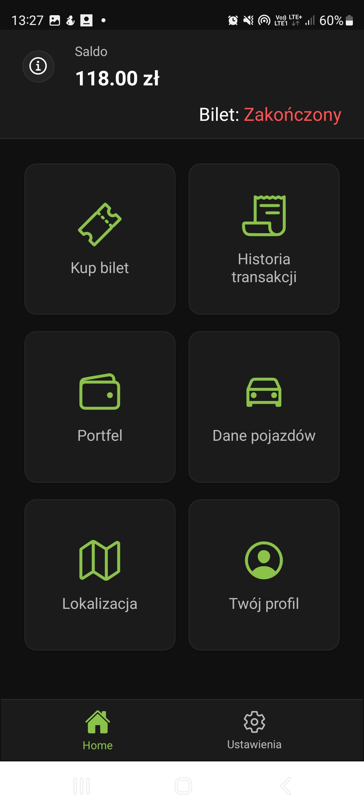
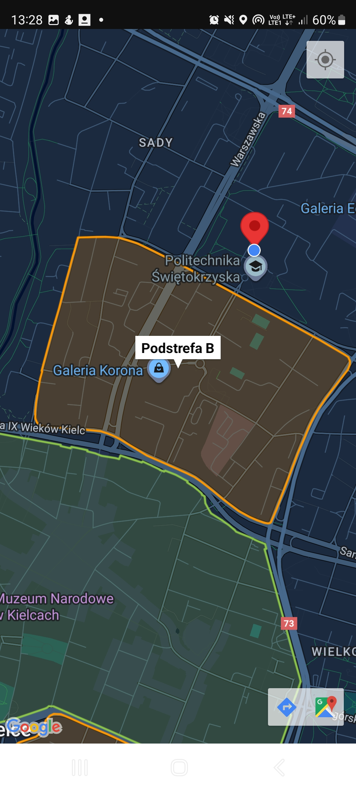
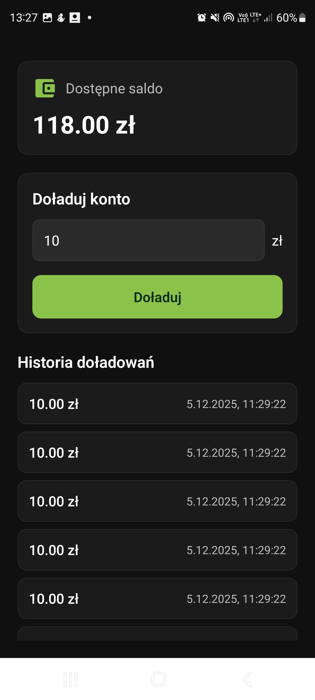
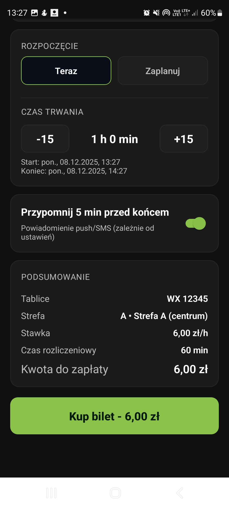
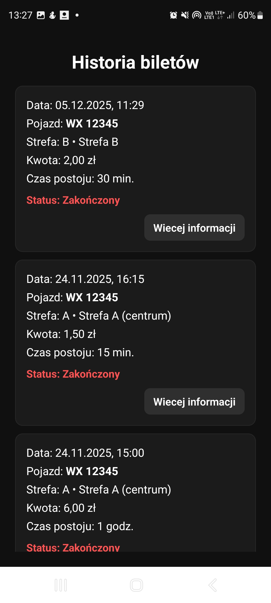
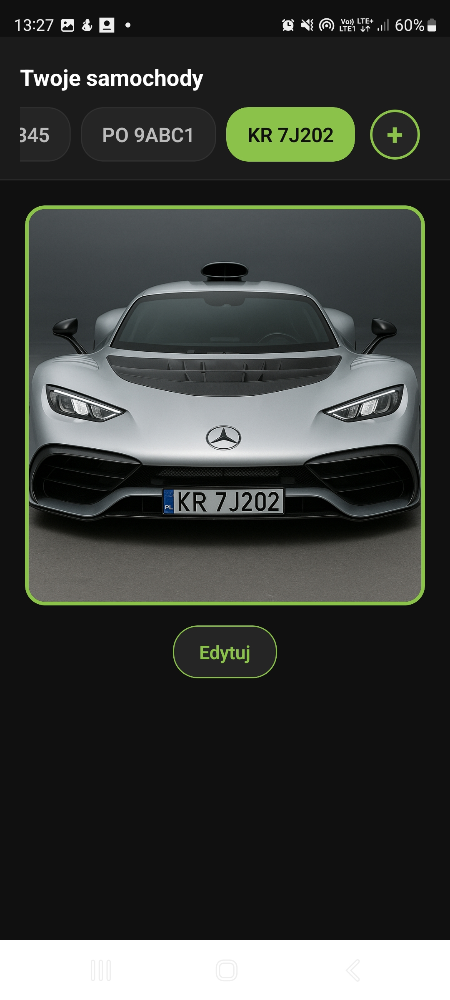
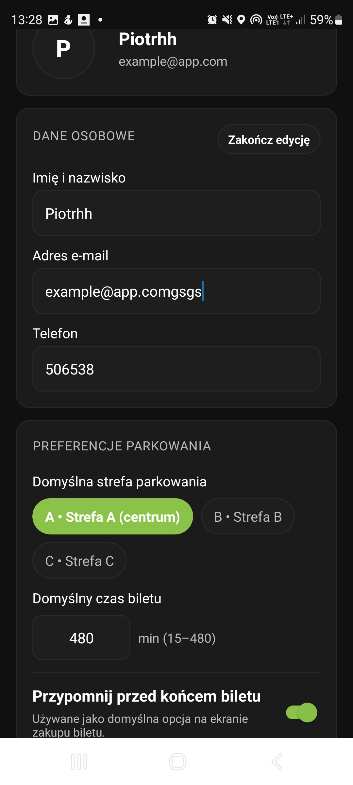
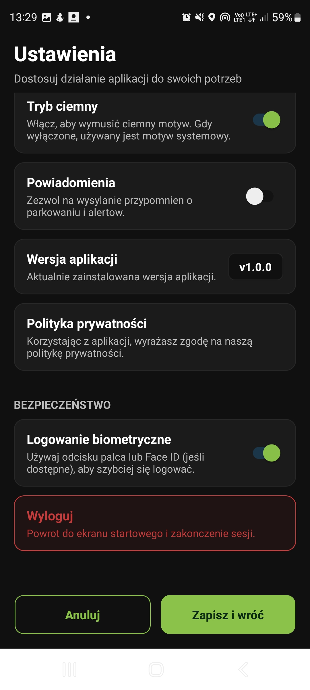

# apk_parking

   

Aplikacja mobilna Expo do obsługi płatnego parkowania w strefach miejskich: zakup biletu, mapa stref, portfel użytkownika, zarządzanie pojazdami oraz profil z ustawieniami bezpieczeństwa i powiadomień.

## Galeria

| Start                                             | Logowanie                                    | Rejestracja                                       |
| ------------------------------------------------- | -------------------------------------------- | ------------------------------------------------- |
|  |  |  |

| Home                                           | Mapa                                        | Portfel                                     |
| ---------------------------------------------- | ------------------------------------------- | ------------------------------------------- |
|  |  |  |

| Bilet                                            | Transakcje                                                   | Samochody                                |
| ------------------------------------------------ | ------------------------------------------------------------ | ---------------------------------------- |
|  |  |  |

| Profil                                                  | Ustawienia                                       |
| ------------------------------------------------------- | ------------------------------------------------ |
|  |  |

## Funkcjonalności

- Ekrany start, rejestracja i logowanie z obsługą biometrii (expo-local-authentication) oraz mock API.
- Dashboard z bieżącym saldem, statusem i odliczaniem biletu oraz skrótami do kluczowych modułów.
- Zakup biletu: wybór pojazdu (dodawanie tablic), stref A/B/C z cennikiem, start teraz lub zaplanowany, czas w krokach 15 min, przypomnienie przed końcem, podsumowanie płatności i zapis w AsyncStorage.
- Historia transakcji: statusy aktywny/zaplanowany/zakończony, szczegóły biletu, możliwość przedłużenia aktywnego postoju z wykorzystaniem salda.
- Portfel: doładowania dowolną kwotą z historią operacji zapisywaną lokalnie.
- Samochody: lista i wybór pojazdów, dodawanie nowych tablic, przykładowe zdjęcia aut.
- Mapa stref płatnych: bieżąca lokalizacja użytkownika, poligony stref z `assets/strefy.json`, znaczniki z nazwami stref.
- Profil: dane osobowe, domyślna strefa i czas biletu, preferencje powiadomień, zgody marketingowe, etykieta metody płatności (karta/BLIK).
- Ustawienia: wymuszenie trybu ciemnego, przełącznik powiadomień i biometrii, wersja aplikacji z `app.json`, wylogowanie do ekranu startowego.

## Stack technologiczny

- **Core:** Expo ~54.0.27, React Native 0.81.5, React 19.1, TypeScript ~5.9, AsyncStorage, expo-status-bar, expo-navigation-bar, @expo/vector-icons.
- **Nawigacja:** React Navigation 7 (native-stack, bottom-tabs), react-native-screens, react-native-safe-area-context.
- **Mapy i lokalizacja:** react-native-maps 1.20.1, expo-location 19, dane stref w `assets/strefy.json` (skrypt konwersji `assets/konwersjaMap.py`).
- **Bezpieczeństwo/UX:** expo-local-authentication (biometria), react-native-keyboard-aware-scroll-view.
- **Backend / Mock:** json-server ^1.0.0-beta.3 (`mock-api/server.js`, `mock-api/db.json`), domyślny endpoint `http://localhost:3001/login`, zmienna `EXPO_PUBLIC_API_URL` do nadpisania URL.

## Instalacja i uruchomienie

1. Klonuj repozytorium i zainstaluj zależności:
   ```bash
   git clone https://github.com/makus2115/apk_parking.git
   cd apk_parking
   npm install
   ```
2. Uruchom mock API (osobne okno terminala):
   ```bash
   npm run mock-api
   ```
   - domyślnie dostępne pod `http://localhost:3001` (port można zmienić przez `MOCK_API_PORT`)
   - dane logowania demo: `demo@parking.app` / `demo123` lub `user@parking.app` / `haslo123`
   - aplikacja użyje `EXPO_PUBLIC_API_URL` jeśli zostanie ustawione, inaczej domyślnie `http://localhost:3001`
3. Start aplikacji (Expo):
   ```bash
   npm start          # tryb developerski / Expo Go
   npm run android    # natywny build/uruchomienie na Androidzie
   npm run ios        # natywny build/uruchomienie na iOS
   ```
4. Wymagania środowiska:
   - Node.js, npm, Expo CLI; zainstalowane środowisko Android/iOS lub Expo Go.
   - `app.json` ustawia `userInterfaceStyle: "dark"` oraz `newArchEnabled: true` (nowa architektura RN).

## Struktura katalogów

```
apk_parking/
├─ App.tsx
├─ app.json
├─ index.ts
├─ package.json
├─ tsconfig.json
├─ assets/
│  ├─ adaptive-icon.png
│  ├─ icon.png
│  ├─ parking.png
│  ├─ splash-icon.png
│  ├─ strefy.geojson
│  ├─ strefy.json
│  ├─ map_org.geojson
│  ├─ konwersjaMap.py
│  └─ cars/
│     ├─ car1.png
│     ├─ car2.png
│     └─ car3.png
├─ mock-api/
│  ├─ db.json
│  └─ server.js
└─ src/
   ├─ components/
   │  ├─ AppButton.tsx
   │  ├─ ScreenWrapper.tsx
   │  └─ index.ts
   ├─ hooks/
   │  └─ useAppThemeLogic.ts
   ├─ navigation/
   │  ├─ AppNavigator.tsx
   │  ├─ AuthNavigator.tsx
   │  ├─ MainTabNavigator.tsx
   │  └─ types.ts
   ├─ screens/
   │  ├─ StartScreen.tsx
   │  ├─ LoginScreen.tsx
   │  ├─ RegisterScreen.tsx
   │  ├─ HomeScreen.tsx
   │  ├─ TicketScreen.tsx
   │  ├─ TransactionScreen.tsx
   │  ├─ WalletScreen.tsx
   │  ├─ CarScreen.tsx
   │  ├─ MapScreen.tsx
   │  ├─ UserProfileScreen.tsx
   │  ├─ SettingsScreen.tsx
   │  └─ ScreenTemplate.tsx
   ├─ services/
   │  ├─ authApi.ts
   │  └─ authStorage.ts
   ├─ theme/
   │  └─ ThemeContext.tsx
   └─ types/
```
